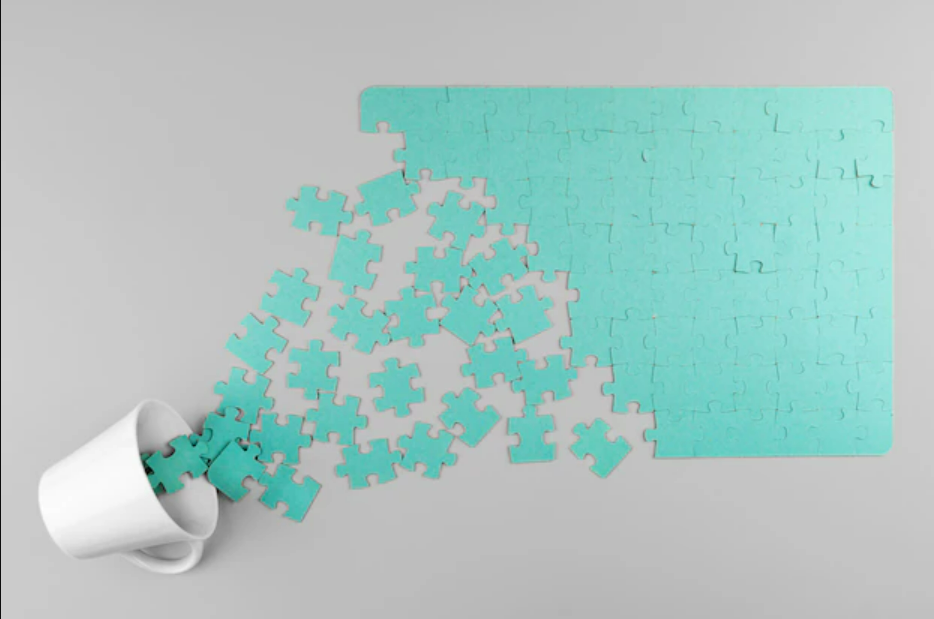
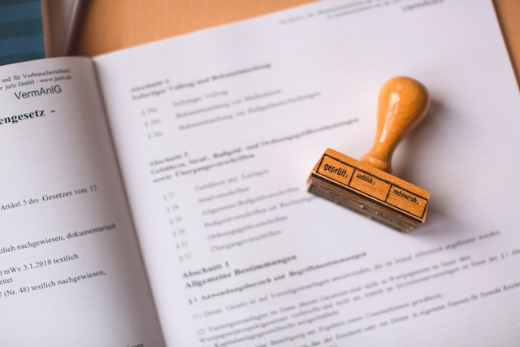
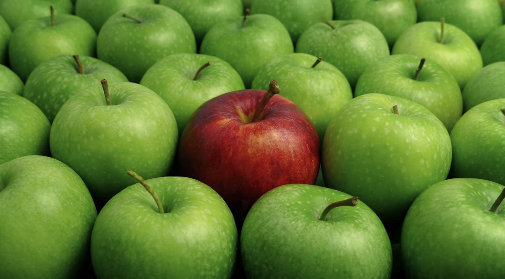
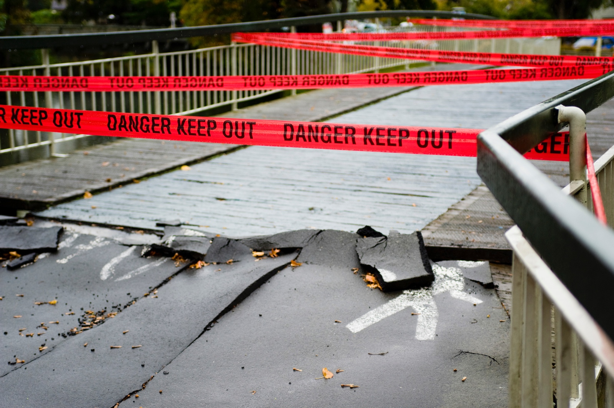

# Sara Nóbrega - R&D Engineer (Data Science)

Hey there! This is a collection of my machine learning projects performed during my work, internships and free time. 

# Current Work
* R&D Engineer (Data Science) @EDP - Lisbon, 2023-present
  
# Internships
* Data Science Internship @Workist - Berlin, 2022/2023
* Machine Learning Internship @Irdeto - Amsterdam, 2022

# Education
* Master's of Science (Physics, Astrophysics, Focus in Data Science), University of Lisbon, 2019-2022
* Bachelor's of Science (Physics), University of Lisbon, 2016-2019

# Certifications
**Azure:**

* [Train and deploy a machine learning model with Azure Machine Learning](https://learn.microsoft.com/api/achievements/share/en-us/SARANBREGA-6785/CWL8E4L9?sharingId=2092C01B30C4195A)
* [Introduction to virtual machines in Microsoft Azure](https://coursera.org/share/1a08de6c0893b2f561503b40bfae709f)
* [Design a machine learning solution in Azure](https://learn.microsoft.com/api/achievements/share/en-us/SARANBREGA-6785/3X676BLH?sharingId=2092C01B30C4195A)
* [Perform hyperparameter tuning with Azure Machine Learning](https://learn.microsoft.com/api/achievements/share/en-us/SARANBREGA-6785/3XLJZ9WH?sharingId=2092C01B30C4195A)
* [AutoML model selection with Azure Machine Learning](https://learn.microsoft.com/en-us/users/saranbrega-6785/achievements/7e8yly2z)
* [Microsoft Azure Data Fundamentals: Explore data analytics in Azure](https://learn.microsoft.com/en-gb/training/achievements/learn.wwl.azure-data-fundamentals-explore-data-warehouse-analytics.trophy?username=SaraNbrega-6028)
* [Microsoft Azure Fundamentals: Describe cloud concepts](https://learn.microsoft.com/en-us/training/achievements/learn.wwl.microsoft-azure-fundamentals-describe-cloud-concepts.trophy?username=SaraNbrega-6028)
  
**Data Presentation Skills:**

* [Communicating Data Effectively in Data Presentation Skills](https://drive.google.com/file/d/1TN7eZ8C5NZ7Qmd513Xz8R--TZ4Lnda2U/view?usp=sharing)
* [Telling Stories with Data in Data Presentation Skills](https://drive.google.com/file/d/11fcA_J550nzW3OpEReLPKkkjeQ5ZgLaS/view?usp=sharing)
  
**API Design:**
* [Designing RESTful APIs](https://drive.google.com/file/d/1ZMH6DSdEci8w1wHu3uOecoGRYZle-e_a/view)
  
**Data Analysis and Time Series:**
* [Applied Time Series Analysis in Python](https://drive.google.com/file/d/1wno6AjNSYqb-WdbaV4-N0MvN83jjApZk/view)
  
**Version Control and Collaboration:**
* [Git and Github](https://drive.google.com/file/d/1AoUonO8l2-MICmV7P12LQgjdT_hT-hw-/view)

**Machine Learning:**
* [Machine Learning knowledge certification](https://triplebyte.com/tb/sara-nobrega-qieh36i/certificate)
* [Data Preparation with SQL](https://drive.google.com/file/d/142wQK70ZeOEmWVzERoE6AZ0eOEF-MBm_/view)
  
**SQL:**
* [SQL Bootcamp](https://drive.google.com/file/d/1xhIfte81F_vMhDJDX3o79yJj_9KN5QBG/view)

# Projects

# [Synthetic Wind-Turbine Data Generation with ParModel](https://github.com/saranobrega/PAR_model_synthetic_data)
#### Keywords: Synthetic Data; ParModel; Wind-Turbine Data

Efficiently addressing data scarcity and privacy concerns in wind-turbine research through synthetic data generation using ParModel.
* Python Libraries: deepecho, numpy, matplotlib, pandas, scipy, sdmetrics
* **Input:** Real wind-turbine data with 10-minute resolution
* **Output:** Generated synthetic wind-turbine data, preserving statistical properties and overcoming limitations in real-world datasets.

# [Wind Turbine Data Gap Filling with LightGBM](https://saranobrega.github.io/2023/12/29/fill-gaps.html)
#### Keywords: LightGBM; Missing data; Time-series Data

To address gaps in wind turbine time-series data efficiently using LightGBM, enhancing data completeness for accurate analysis.
* Python Libraries: LightGBM
* Additional Tools: pandas, matplotlib, streamlit, numpy
* **Input:** Time-series Wind Turbine data 
* **Output:**  Imputed wind speed data where gaps or missing values were present. Predictions are made for the missing data points using the trained LightGBM model.

# [Document Understanding Project](https://github.com/saranobrega/Document-Understanding-Project/blob/main/README.md)
#### Keywords: Computer Vision; Object Detection; Deep learning; Document Understanding, Faster-RCNN

Implementing the Faster-RCNN model for document understanding. The goal is to detect main features in document images, namely headers, tables, footers and order line items.

* **Python libraries used:** Pytorch Lightning, Pandas, Numpy, Seaborn
* **Others:** Hugging Face, Wandb
* **Input:** Images of Documents
* **Output:** Bounding Boxes + Classification of each document

# [Anomaly detection Project](https://github.com/saranobrega/Anomaly-detection-Project)
#### Keywords: Anomaly detection; Outlier Detection, Supervised, Unsupervised, Isolation Forest, ANN

Created a new unsupervised method to detect anomaly samples using Isolation Forest and ANN.

* **Python libraries used:** Keras, Tensorflow, Matplotlib
* **Input:** Pixel data (MNIST); model state of the MNIST 10-digit classifier model
* **Output:** Probablity of a data point being an outlier; Isolation Forest scores. 

# [E-mail Text Classification Project](https://github.com/saranobrega/E-mail-Text-Classification-Project)

Implementing the modern Transformer-based model [BERT](https://huggingface.co/docs/transformers/model_doc/bert) model for a multi-class text classification project.
#### Keywords: Natural Language Processing, Text Classification, Transformers
* **Python libraries used:** Pytorch Lightning, Pandas, Numpy, Seaborn
* **Others:** Hugging Face, Wandb
* **Input:** E-mail Text
* **Output:** Category of Email (Spam, Order, Complaints...)

# [AI for Damage Detection Challenge](https://github.com/saranobrega/AI-for-Damage-Inspection-Project)
#### Keywords: Computer Vision; Object Detection; Deep learning

 
Using object detection models to detect damages in bridges. Detecting defects on a bridge surface to aid in more effective and efficient bridge inspections.
* Python libraries used: TensorFlow, Keras
* **Input:** Drone Images
* **Output:** Binary output (damaged/not damaged); Classification of the type of damage.
